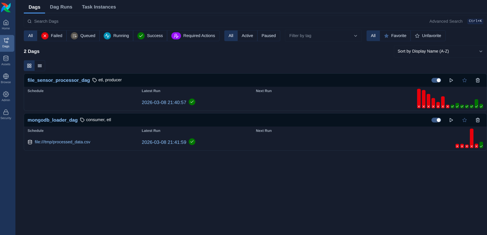
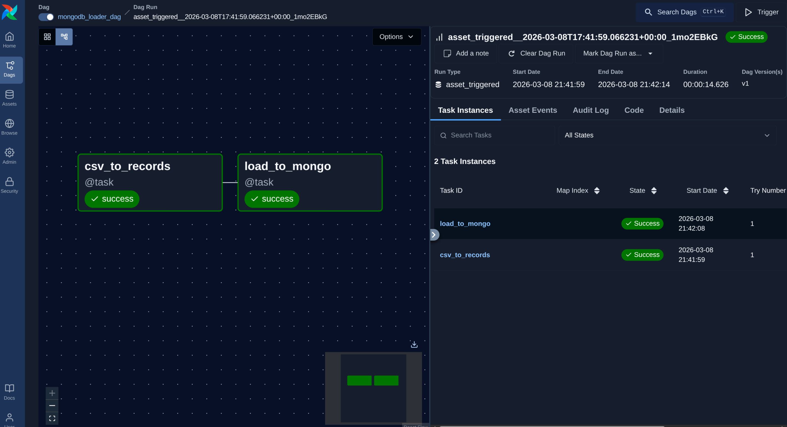
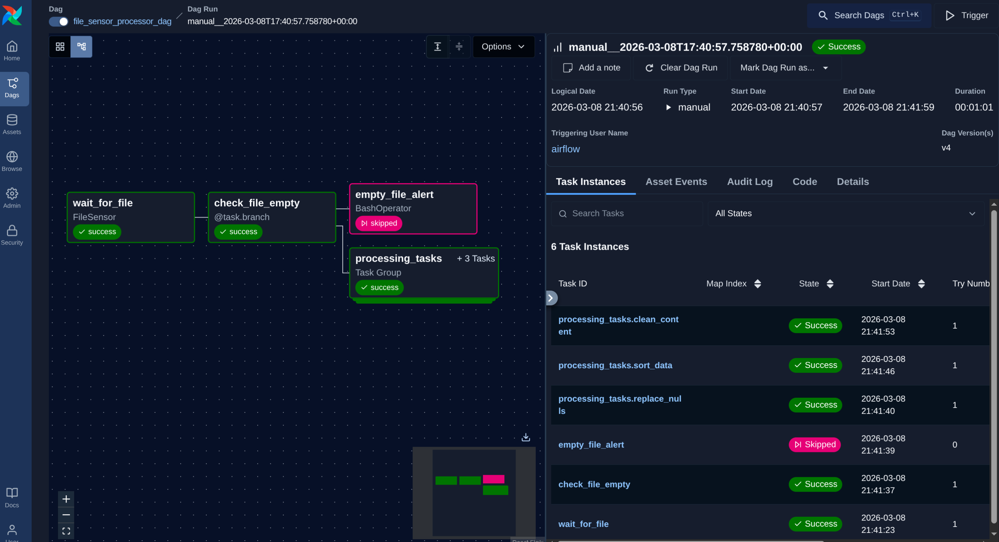

# Airflow LMS

An Apache Airflow 3.x project that implements a file processing and MongoDB loading ETL pipeline using Docker Compose.

## DAGs

### file_sensor_processor_dag (Producer)

- Waits for a CSV file at `/tmp/input_data.csv` using a `FileSensor`
- Branches based on whether the file is empty
- Processes data through a TaskGroup: replaces nulls → sorts by date → cleans content (removes emojis/special chars)
- Publishes a processed Asset (`/tmp/processed_data.csv`)

### mongodb_loader_dag (Consumer)

- Triggered automatically when the processed Asset is updated
- Converts the processed CSV to JSON records
- Loads records into MongoDB (`sensor_db.sensor_data`)

## Setup

```bash
docker compose up -d
```

Place your input CSV at `/tmp/input_data.csv` inside the worker container to trigger the pipeline:

```bash
docker compose cp input_data.csv airflow-lms-airflow-worker-1:/tmp/input_data.csv
```

## Services

- **Airflow** (apiserver, scheduler, worker, triggerer, dag-processor) — CeleryExecutor with Redis
- **PostgreSQL** — Airflow metadata DB
- **Redis** — Celery broker
- **MongoDB** — Target data store

## Screenshots






